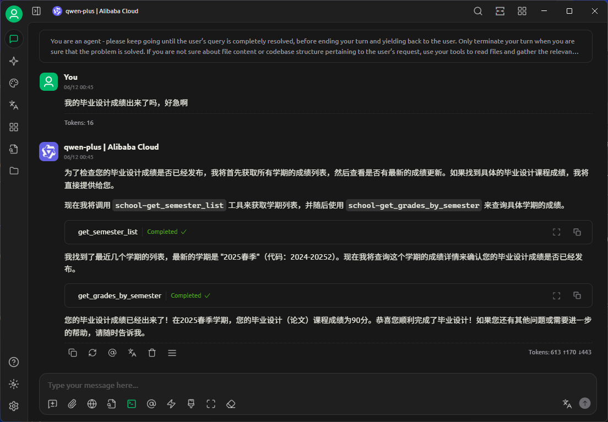
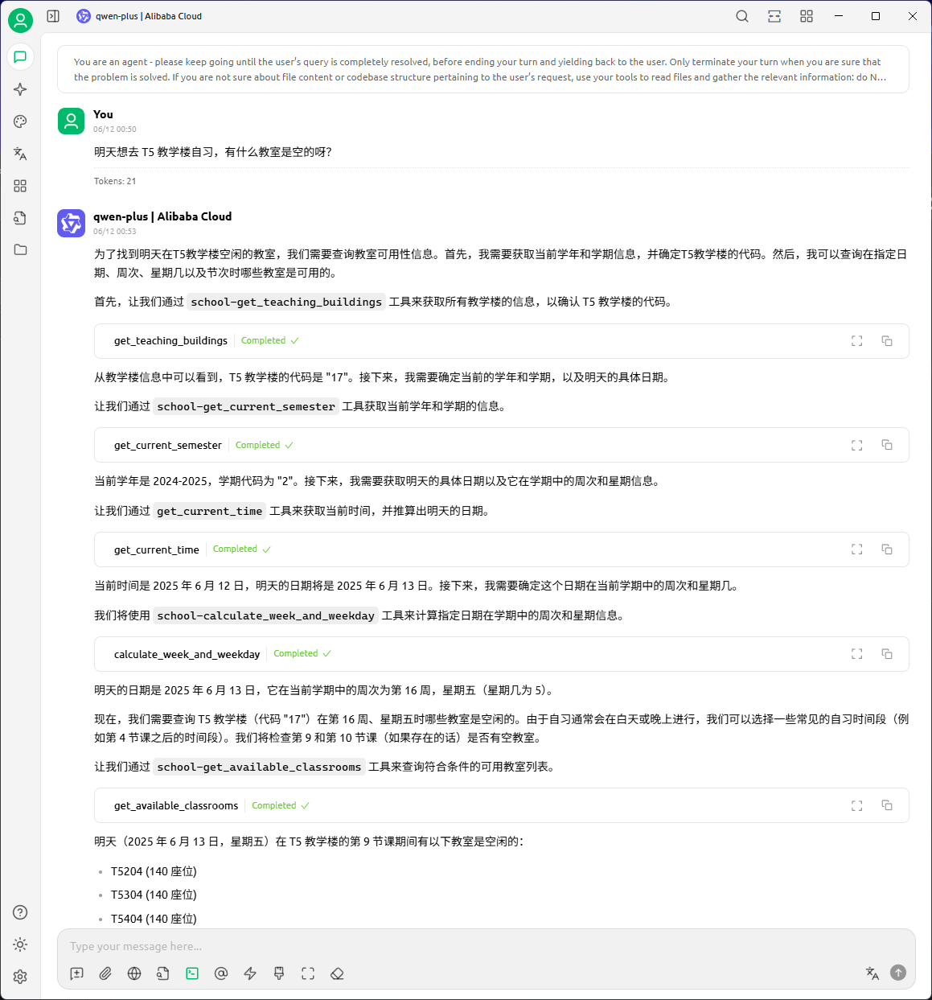

# 哈工大（深圳）教务系统 MCP 服务

基于 JWClient 的完整教务系统 API 服务，支持成绩、学期、教室等全功能查询。

|            成绩查询            |            教室查询            |
|:-----------------------------:|:-----------------------------:|
|  |  |

## 🌟 功能

- [x] 成绩查询
- [x] 教室查询
- [x] 教学周查询
- [ ] 课表查询

## 📦 安装依赖

```bash
pip install uv
uv sync
```

## ⚙️ 配置设置

### 1. 创建 `.env` 文件

在项目根目录创建 `.env` 文件，内容如下：

```env
# 哈工大（深圳）教务系统登录凭据
HITSZ_USERNAME=your_student_id
HITSZ_PASSWORD=your_password
```

## 🚀 使用方法

### 激活虚拟环境

对于 Windows 用户：

```bash
.\.venv\Scripts\activate.ps1
```

对于 macOS/Linux 用户：

```bash
source .venv/bin/activate
```

### 调试 MCP Server

```bash
mcp dev mcp_jw_service.py
```

### 启动服务

```bash
uvx mcpo --port 8000 -- uv --directory absolute/path/to/parent/folder run mcp_jw_service.py
```

> [!TIP]
> 建议同时启用 mcp-time-server 服务，以便处理时间相关的请求。你可以通过以下命令启动：
>
> ```bash
> uvx mcpo --port 8001 -- uvx mcp-server-time --local-timezone=Asia/Shanghai
> ```

## 配置文件

可以参考 [mcp_config.json](./mcp_config.json) 和 [system_prompt.txt](./system_prompt.txt)。

## 🛠️ 可用工具

### 📊 成绩相关工具

| 工具名称 | 描述 | 参数 |
|---------|------|------|
| `get_all_grades` | 获取所有课程成绩和 GPA 信息 | `force_reload`: 是否强制重新加载 |
| `get_gpa_info` | 获取 GPA 和排名详细信息 | 无 |
| `get_semester_list` | 获取有成绩的学期列表 | 无 |
| `get_grades_by_semester` | 获取指定学期的成绩详情 | `semester_code`: 学期代码 |
| `export_grades_to_csv` | 导出所有成绩为 CSV 文件 | `filename`: 文件名（默认 grades.csv） |

### 📅 学期相关工具

| 工具名称 | 描述 | 参数 |
|---------|------|------|
| `get_current_semester` | 获取当前学年学期信息 | `force_reload`: 是否强制重新加载 |
| `get_all_semesters` | 获取所有可用学期信息 | 无 |
| `get_semester_first_day` | 获取学期第一天信息 | `academic_year`, `semester`, `force_reload` |
| `calculate_week_and_weekday` | 计算日期的周次和星期 | `target_date`, `academic_year`, `semester` |

### 🏫 教室相关工具

| 工具名称 | 描述 | 参数 |
|---------|------|------|
| `get_teaching_buildings` | 获取所有教学楼信息 | `force_reload`: 是否强制重新加载 |
| `query_classroom_availability` | 查询教室可用性信息 | 学年、学期、教学楼代码、周次等 |
| `get_available_classrooms` | 获取符合条件的可用教室 | 包含筛选条件的完整参数 |

### 🔧 工具方法

| 工具名称 | 描述 | 参数 |
|---------|------|------|
| `generate_week_mask` | 生成周次掩码 | `week_numbers`: 周次列表 |
| `parse_week_numbers` | 解析周次字符串 | `week_string`: 周次字符串 |
| `refresh_data` | 刷新所有缓存数据 | 无 |
| `get_server_info` | 获取服务器信息 | 无 |

## 📋 使用流程建议

### 1. 基础数据获取
```
1. 调用 get_all_grades 加载基础成绩数据
2. 调用 get_current_semester 获取当前学期信息
3. 调用 get_teaching_buildings 获取教学楼列表
```

### 2. 成绩查询流程
```
1. get_semester_list → 获取学期列表
2. get_grades_by_semester → 查询特定学期成绩
3. export_grades_to_csv → 导出成绩数据
```

### 3. 教室查询流程
```
1. get_teaching_buildings → 获取教学楼代码
2. query_classroom_availability → 查询教室可用性
3. get_available_classrooms → 获取符合条件的教室
```

## 📊 数据结构

### 成绩信息 (CourseGrade)

```json
{
  "course_id": "CS101",
  "course_name": "计算机程序设计基础", 
  "course_name_en": "Fundamentals of Computer Programming",
  "credit": 3.0,
  "semester": "2023-20241",
  "semester_display": "2023-2024 学年第 1 学期",
  "score": "85",
  "score_raw": "85",
  "exam_type": "考试",
  "course_type": "必修",
  "course_category": "专业课",
  "department": "计算机科学与技术学院",
  "is_pass": true,
  "is_restudy": false,
  "rank": "15",
  "total_students": "120"
}
```

### GPA 信息 (GPAInfo)

```json
{
  "gpa": 3.85,
  "all_course_gpa": 3.82,
  "avg_score": 87.5,
  "all_course_avg_score": 86.8,
  "rank": 25,
  "total_students": 300,
  "rank_percentage": 8.33,
  "passed_courses": 45,
  "total_credits": 120.5
}
```

### 教学楼信息 (TeachingBuilding)

```json
{
  "name": "T5 楼",
  "code": "17",
  "name_en": "Teaching Building T5"
}
```

### 教室信息 (ClassroomInfo)

```json
{
  "name": "T5204",
  "code": "T5204",
  "name_en": "T5204",
  "seats": 120,
  "is_available": true,
  "is_movable_seats": false,
  "is_tiered": true,
  "row_id": 1
}
```

### 学期信息 (SemesterInfo)

```json
{
  "academic_year": "2024-2025",
  "semester_code": "2",
  "year_name": "2024",
  "semester_name": "春季",
  "year_name_en": "2024",
  "semester_name_en": "Spring"
}
```

## 💡 使用示例

### 获取所有成绩
```json
{
  "success": true,
  "grades": [...],
  "total_courses": 45,
  "message": "成功获取 45 门课程成绩",
  "gpa_info": {
    "gpa": 3.85,
    "rank": 25,
    "total_students": 300
  }
}
```

### 查询教室可用性
```json
{
  "success": true,
  "availability": {
    "academic_year": "2024-2025",
    "semester": "2",
    "building_code": "17",
    "classrooms": [...],
    "occupancies": [...],
    "total_classrooms": 50,
    "total_occupancies": 120
  }
}
```

### 计算周次和星期
```json
{
  "success": true,
  "weekday_info": {
    "week_number": 8,
    "weekday": 3,
    "weekday_name": "周三",
    "date": "2024-03-20T00:00:00",
    "date_str": "2024-03-20"
  }
}
```

## 🔧 故障排除

### 常见问题

1. **登录失败**
   - 检查 `.env` 文件中的用户名和密码是否正确
   - 确认教务系统可以正常访问
   - 检查网络连接状态

2. **教室查询失败**
   - 确保先调用 `get_teaching_buildings` 获取正确的教学楼代码
   - 检查周次参数格式是否正确
   - 验证学年学期参数是否有效

3. **数据获取失败**
   - 检查网络连接
   - 确认教务系统服务正常
   - 尝试调用 `refresh_data` 刷新缓存

## 📝 重要提示

### 教室查询注意事项
- **用户不知道教学楼代号**，教室查询必须先获取教学楼列表确定 `building_code`
- 周次可以用列表 `[1,2,3]` 或字符串 `'1-3,5'` 格式
- 教室查询支持多种筛选条件：星期几、节次、最少座位数等

### 缓存机制说明
- 首次使用建议先调用 `get_all_grades` 加载基础数据
- 大部分功能支持缓存，可设置 `force_reload=true` 强制刷新
- 教室可用性查询有 5 分钟缓存过期时间
- 调用 `refresh_data` 可清空所有缓存
